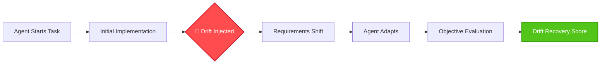

<div align="center">

# ⚡ SpecDriftBench

**Evaluating Coding-Agent Reliability Under Changing Requirements**

[](https://www.python.org/downloads/release/python-3110/)
[](https://opensource.org/licenses/MIT)
[](https://www.docker.com/)
[](https://openai.com/)

*Real-world software engineering isn't static. Why should our benchmarks be?*

</div>

---

## 🚀 The Motivation

Most coding benchmarks (like HumanEval or SWE-bench) evaluate an agent's ability to solve a **fixed issue**. The agent receives a prompt, writes code, and is graded. 

However, real-world software engineering is highly dynamic:
- 🔄 **Requirements change** mid-sprint.
- 📦 **Dependencies get deprecated**.
- 🌩️ **Environments break**.

**SpecDriftBench** measures whether state-of-the-art coding agents can handle these realities. It tests their ability to detect changing constraints, adapt their implementation, and preserve prior valid work without introducing regressions.

## 🏗️ How It Works



## ✨ Key Features

- 🕵️ **Dynamic Drift Engine:** Deterministically injects drift events mid-execution.
- 🐳 **Docker Isolation:** Secure, containerized execution of untrusted model code.
- 📊 **Objective Evaluator:** Uses independent, test-driven metrics for adaptation and regression.
- 🧩 **Provider-Agnostic API:** Easily plug in any LLM or Agent architecture.

## 🌪️ Drift Taxonomy

SpecDriftBench evaluates agents across a comprehensive spectrum of real-world drift scenarios:

| Drift Type | Description |
| :--- | :--- |
| 💼 **REQUIREMENT_DRIFT** | Business logic or feature requirements change. |
| 🔗 **DEPENDENCY_DRIFT** | Core library versions or APIs change abruptly. |
| 🔌 **API_DRIFT** | External endpoint schemas or payloads change. |
| ☁️ **INFRASTRUCTURE_DRIFT** | Database or microservice unavailability. |
| 🔒 **SECURITY_DRIFT** | New compliance or security constraints introduced. |
| ⚡ **PERFORMANCE_DRIFT** | Strict latency or scaling requirements added. |
| 📖 **DOCUMENTATION_DRIFT** | Misalignment between authoritative docs and reality. |
| 🚫 **CONSTRAINT_DRIFT** | Sudden restrictions on allowed tools or libraries. |

## 📈 Evaluation Metrics

We introduce the **Drift Recovery Score (DRS)**, an experimental metric that combines:
1. **Initial Success ($C$):** Correctness before the drift occurs.
2. **Drift Detection ($D$):** Did the agent notice the environment changed?
3. **Adaptation Quality ($A$):** Did the agent successfully implement the new requirement?
4. **Regression Avoidance ($R$):** Did the agent break prior working code?

**$$ DRS = C \times D \times A \times R $$**

## 💻 Quick Start

### 1. Installation
Clone the repository and install the framework with development dependencies:
```bash
git clone https://github.com/ravindra-RKB/SpecDriftBench.git
cd SpecDriftBench
pip install -e .[dev]
```

### 2. Preflight Check
Ensure your environment (Docker, API keys) is ready for a genuine experiment:
```bash
export SPECDRIFT_OPENAI_API_KEY="sk-..."
export SPECDRIFT_OPENAI_MODEL="gpt-4-turbo"
specdrift doctor
specdrift preflight --agent openai --execution-mode docker
```

### 3. Run the Benchmark
Execute a specific task with the agent:
```bash
specdrift run tasks/task_001_auth_drift --agent openai
```

### 4. Evaluate & Verify
```bash
specdrift evaluate runs/<RUN_ID>
specdrift verify-run <RUN_ID>
```

## 🧪 Testing the Framework

Don't want to burn API credits? Use the built-in deterministic `MockAgent` to validate the evaluation pipeline:
```bash
specdrift run tasks/task_001_auth_drift --agent mock-perfect
```

## 🛡️ Research Ethics & Limitations

- **No fabricated results.** All trace data and evaluation scripts are designed to be open source to ensure reproducibility.
- **Limitations:** The synthetic nature of drift events makes it difficult to perfectly isolate adaptation costs.
- **Contamination:** Care must be taken to prevent benchmark contamination in LLM training data.

---
<div align="center">
<i>Built for the next generation of autonomous software engineers.</i>
</div>
